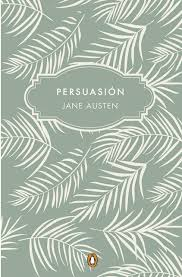

# EJEMPLOS DE MARKDOWN.

**Tablas en Markdown de libros favoritos.**

~~~
| LIBRO | AUTOR | Cant. en mi biblioteca | Cant. de veces leída |
| --- | --- | --- | --- |
| Orgullo y prejuicio| Jane Austen | 3 | 4 |
| Yo antes de ti | Jojo Moyes | 1 | 2 |
| Persuasión | Jane Austen | 2 | 1|
| Sangre de campeón. Sin Cadenas| Carlos Cuauhtémoc Sánchez | 1 | 2 |
|  Sangre de campeón | Carlos Cuauhtémoc Sánchez | 1 | 4 |
| Antes de diciembre | Joana Marcus | 1 | 1 |

~~~

Y se deberia ver así:
| LIBRO | AUTOR | Cant. en mi biblioteca | Cant. de veces leída |
| --- | --- | --- | --- |
| Orgullo y prejuicio| Jane Austen | 3 | 4 |
| Yo antes de ti | Jojo Moyes | 1 | 2 |
| Persuasión | Jane Austen | 2 | 1|
| Sangre de campeón. Sin Cadenas| Carlos Cuauhtémoc Sánchez | 1 | 2 |
|  Sangre de campeón | Carlos Cuauhtémoc Sánchez | 1 | 4 |
| Antes de diciembre | Joana Marcus | 1 | 1 |

**imagenes en Markdown de libros favoritos.**

~~~

Este sería el código para insertar las imagenes:

~~~

Demostración

## Agregar Markdown al texto.

Dentro de las muchos formatos para enriquecer nuestro texto tenemos a: 

Formato en negrilla: 

~~~

Así se escribe el texto en **negrita**.

~~~

Y se verá algo así: 
 **Holii**

*Formato en Cursiva*	

~~~

Así se escribe el texto en *cursiva*.

~~~

Y se verá algo así: 
 *Holii*

*Listas con viñetas*
 ~~~

 Para poner Listas con viñetas se escribe 
 * Viñeta uno (no olvide el espacio después del asterisco)
* Viñeta dos

Se debe escribir un salto de línea antes y después de la lista.

Extra: También se puede comenzar con un guión (-) seguido de un espacio para crear una lista con viñetas.
 ~~~

Y se verá así: 

 * Viñeta uno
* Viñeta dos

*Listas numeradas*

~~~
Para las lista ordenadas se pone el número con un punto, se escribe:

1. Paso uno
2. Paso dos

Debe escribir un salto de línea antes y después de la lista.
~~~

Se ve así:
1. Paso uno
2. Paso dos

*Encabezados*

~~~
Se escribe el código o texto así:

# Encabezado nivel uno (con un espacio después de #)
## Encabezado nivel dos

### Encabezado nivel tres

#### Encabezado nivel cuatro.

Y así sucesivamente.
~~~

# Encabezado nivel uno.

## Encabezado nivel dos.

### Encabezado nivel tres.

#### Encabezado nivel cuatro.

Vínculos	

~~~

Se escribe así:

[Texto para mostrar en el vínculo](inserta URL)Vínculos	

~~~

Se ve así

[Texto para mostrar en el vínculo](http://www.sampleurl.com)
